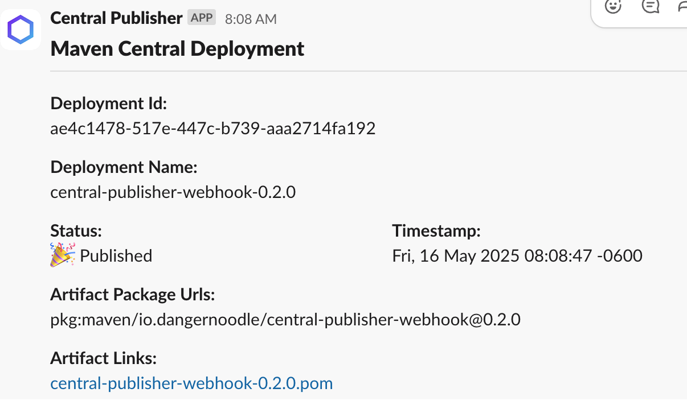

# central-publisher-webhook

AWS Lambda for the [webhook](https://central.sonatype.org/publish-ea/publish-ea-guide/#adding-a-webhook) provided by the
[Central Publisher](https://central.sonatype.org/publish-ea/publish-ea-guide/) which will post messages to Slack.

## Installation

Set up a new [Slack App](https://api.slack.com/apps) or use an existing one if you prefer. Make sure it has
at the `chat:write` scope. You may also grant the `chat:write.public` scope if you do not wish to explicitly
add the app to a channel. You will need the `Bot User OAuth Token` in order to send messages.

**Note:** The app _must_ be added to any private channel you wish to post to.

Create your AWS [API Gateway](https://docs.aws.amazon.com/apigateway/latest/developerguide/welcome.html), 
[Lambda](https://docs.aws.amazon.com/lambda/latest/dg/welcome.html) and [Parameter Store](https://docs.aws.amazon.com/systems-manager/latest/userguide/systems-manager-parameter-store.html)*
infrastructure.

If you use [Terraform](https://www.terraform.io/) or [OpenTofu](https://opentofu.org/), you can find an opinionated
[module](src/main/terraform) to handle this task for you. It includes support for using custom domain names
and downloading the `jar` directly from [Maven Central](https://central.sonatype.com/).

**Note:** If you are rolling your own infrastructure, you _must_ include
the [AWS-Parameters-and-Secrets-Lambda-Extension](https://docs.aws.amazon.com/systems-manager/latest/userguide/ps-integration-lambda-extensions.html)
extension as part of your lambda configuration.

\*Parameter Store was chosen over Secret Manager due to its lower costs and because
encrypted and non-encrypted values can be stored.

### Configuration

If you are rolling your own infrastructure, the lambda function expects the following environment variables:

* `AWS_SESSION_TOKEN`: Automatically provided by the lambda runtime
* `SLACK_APP_TOKEN`: Slack token
* `SLACK_CHANNEL`: Slack channel for posting messages
* `TZ`: Timezone for the lambda execution environment 
* `WEBHOOK_PASSWORD`: Webhook authentication password
* `WEBHOOK_USERNAME`: Webhook authentication username
